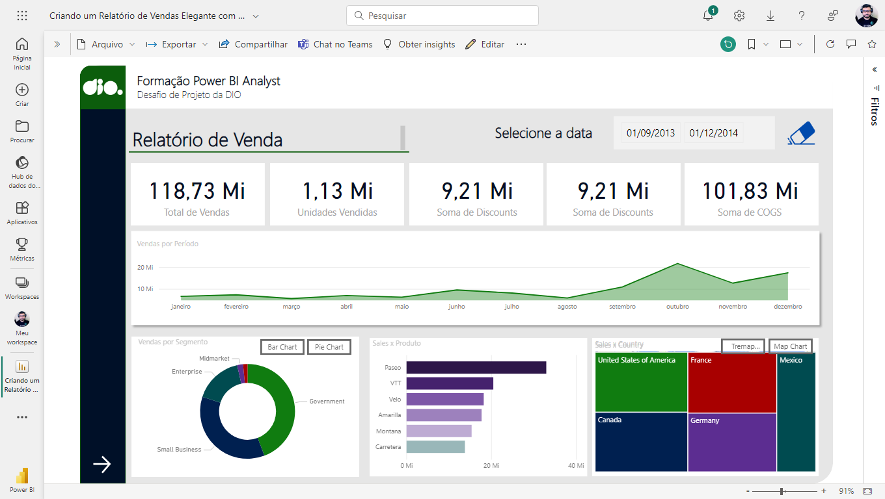
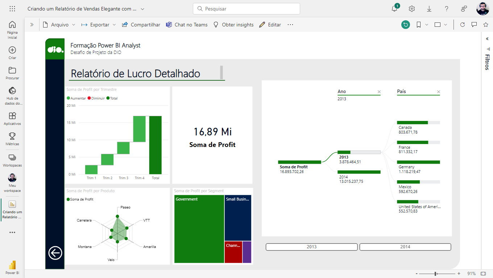

Este é um relatório do Power BI desenvolvido durante o Santander Bootcamp 2023 - Ciência de Dados com Python.

O objetivo deste desafio é criar a segunda página do relatório utilizando o Power BI Desktop.

## Desafios

**Desafio 1**: _Agregação de Dados Temporais_

**Problema**: _Dificuldades na agregação correta dos dados temporais._

**Solução do desafio**: _Implementamos funções DAX avançadas no Power BI para criar uma tabela de datas que permitiu uma agregação precisa dos dados por mês. Isso envolveu a criação de uma coluna de datas e a configuração de uma relação adequada com a tabela de dados para garantir que as informações fossem agrupadas de forma eficiente._

**Desafio 2**: _Visualização Geográfica_

**Problema**: _Dificuldades na exibição clara da distribuição de receitas entre países no mapa._

**Solução do desafio**: _Para melhorar a clareza da visualização geográfica, realizamos ajustes nas configurações do mapa, como a escolha de cores mais intuitivas e a inclusão de rótulos de país. Também revisamos os dados de entrada para garantir que estivessem completos e precisos, o que ajudou a tornar a distribuição de receitas mais compreensível._

**Desafio 3**: _Performance_

**Problema**: _Demora no carregamento do relatório, especialmente na árvore hierárquica na página de "Análise de Lucro"._

Solução do desafio: Focamos na otimização de consultas e na modelagem de dados. Isso envolveu a redução de consultas redundantes, o uso de índices e relacionamentos otimizados, bem como a agregação de dados prévios sempre que possível. Além disso, implementamos técnicas de particionamento de dados para acelerar o carregamento de páginas específicas.

**Desafio 4**: _Coerência na Visualização_

**Problema**: _Dificuldade em manter uma aparência coerente entre diferentes tipos de gráficos e páginas do relatório._

**Solução do desafio**: _Estabelecemos um conjunto de diretrizes de estilo e design que foram aplicadas consistentemente em todas as visualizações. Isso incluiu a padronização de cores, fontes, tamanhos de texto e a organização de informações em gráficos e tabelas. Mantivemos a simplicidade e a clareza como princípios-chave para garantir a coerência visual._

**Desafio 5**: _Publicação do Relatório_

**Problema**: _Dificuldades iniciais na publicação do relatório no Power BI Service, incluindo problemas de compatibilidade e autenticação._

**Solução do desafio**: _Para resolver os problemas de publicação, atualizamos o Power BI Desktop para a versão mais recente, garantindo compatibilidade com o Power BI Service. Além disso, seguimos um procedimento de solução de problemas para lidar com questões de autenticação, incluindo a verificação das configurações de conexão com fontes de dados e a revisão de permissões de acesso. Testamos a publicação em ambientes de pré-produção antes de publicá-la definitivamente para garantir um processo suave._

## Resultados

O relatório revelou que o lucro operacional é substancialmente maior nos Channel Partners, tanto Year-to-Date (YTD) quanto Month-to-Date (MTD), indicando a eficácia desse canal de vendas.
Ao analisar os produtos e sua distribuição por país, destacou-se que o produto "Paseo" é consistentemente o mais popular em todos os países onde ocorrem vendas, sugerindo uma oportunidade de aprimoramento em sua promoção e oferta.

**Eficiência e Usabilidade**:

Para melhorar a eficiência e a experiência do usuário, o relatório foi otimizado para carregamento rápido, tornando-o ágil e amigável.
A inclusão de slicers para análises MTD e YTD permite que os usuários explorem os dados temporalmente de forma fácil e eficaz, proporcionando uma experiência personalizada e informada.

**Análise de Lucro**:

A análise da árvore hierárquica destacou que a França contribui de forma significativa para o lucro global, sugerindo a possibilidade de alocar mais recursos nesse mercado em específico.
O gráfico de radar revelou que o produto "Paseo" apresenta um desempenho excepcional em múltiplos indicadores, o que o torna um forte candidato para promoções ou expansão de mercado, reforçando a tomada de decisões informadas.

**Análise Geográfica**:

O mapa de distribuição de receitas ressaltou que a América do Norte é a principal contribuinte para a receita total, enquanto os mercados europeus ainda apresentam potencial subexplorado, abrindo oportunidades para estratégias de expansão.

## Algumas imagens do relatório

